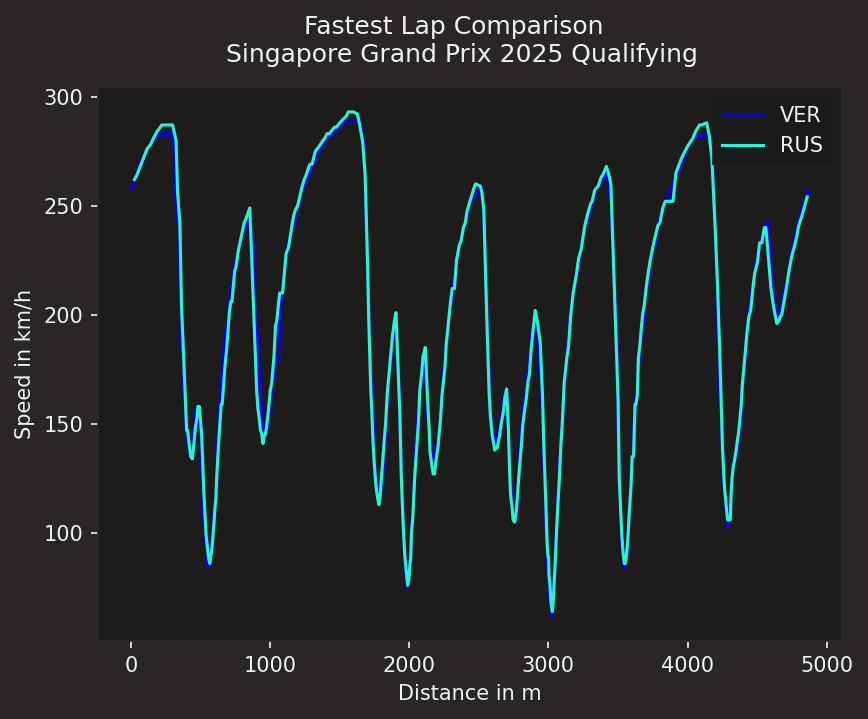
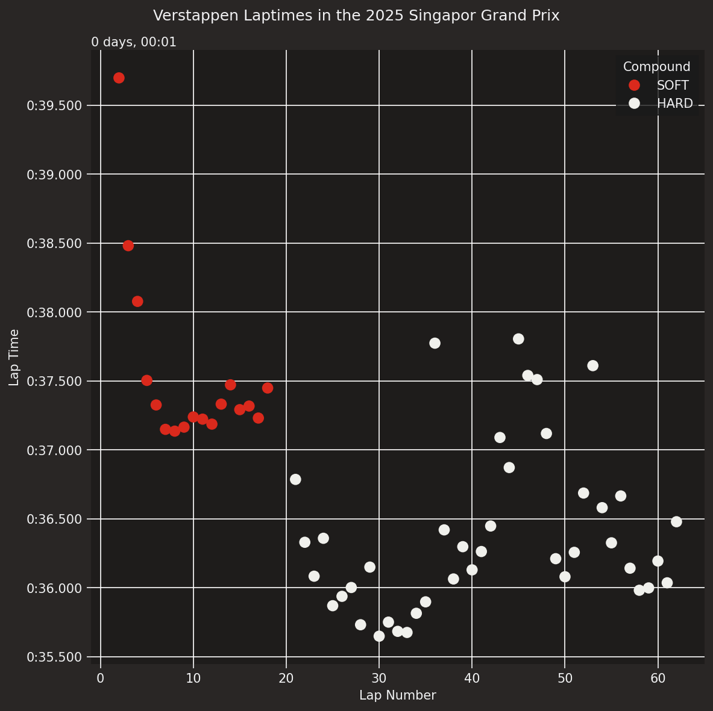
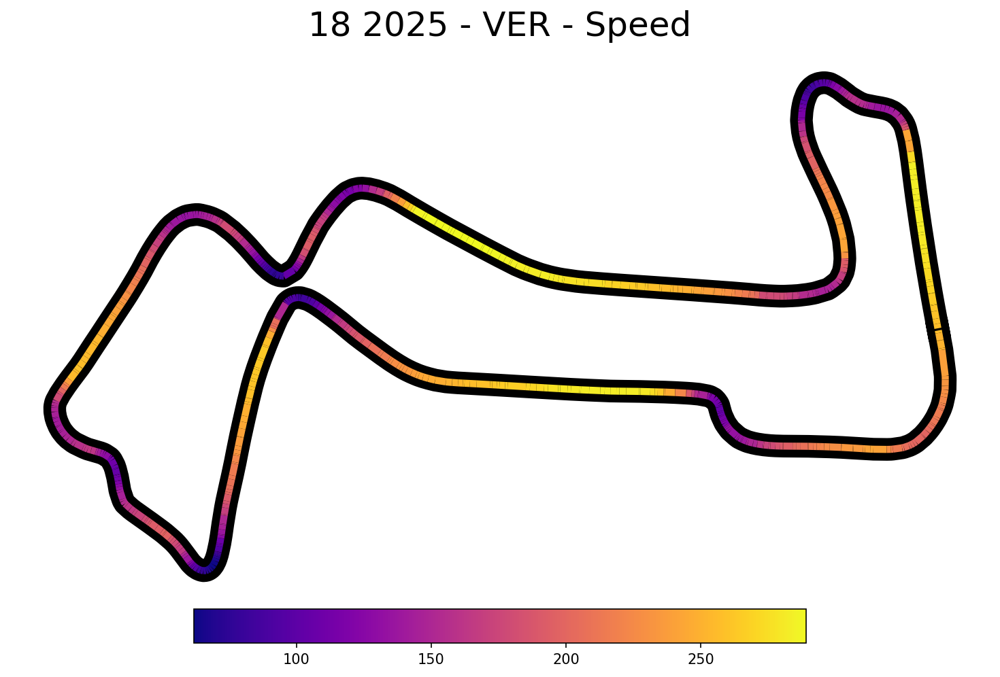

# F1-data-analysis-Verstappen (Singapore Grand Prix 2025)
Analyse de données de F1 avec Python et FastF1

### Analyse des temps au tour
Analyse des temps au tour de Max Verstappen lors du Grand Prix de Singapour 2025

### Comparaison de deux pilotes
Comparaison de la vitesse de Max Verstappen et George Russell sur leur meilleur tour

### Analyse du circuit
Visualisation des données du circuit (vitesse) a partir des données FastF1

## Fichiers
- lap_times.py
- Telemetry.py
- Circuit.py

## Lancer le projet
```bash
pip install fastf1 matplotlib pandas
python Telemetry.py
```
## Comparaison Verstappen vs Russell

## Temps tour Verstappen

## Circuit Singapour Verstappen



Improve README

